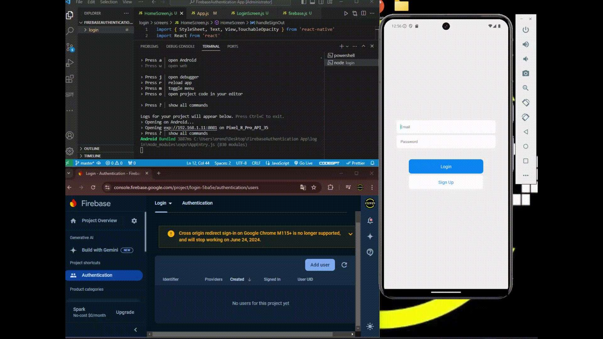

<h1>🚀 Project Announcement: Firebase Authentication with React Native 🚀</h1>

I'm excited to share my latest project where I implemented Firebase Authentication in a React Native application. Here's a quick overview of the development steps:

-->Project Setup and React Navigation Configuration  
-->Creating the Login Screen  
-->Styling the Login Screen with CSS  
-->Storing Email and Password with useState  
-->Connecting to Firebase and User Registration  
-->Login Functionality  
-->Home Page and Logout Functionality  
-->This project demonstrates a seamless integration of Firebase Authentication in a mobile app, providing secure user login and registration.  

